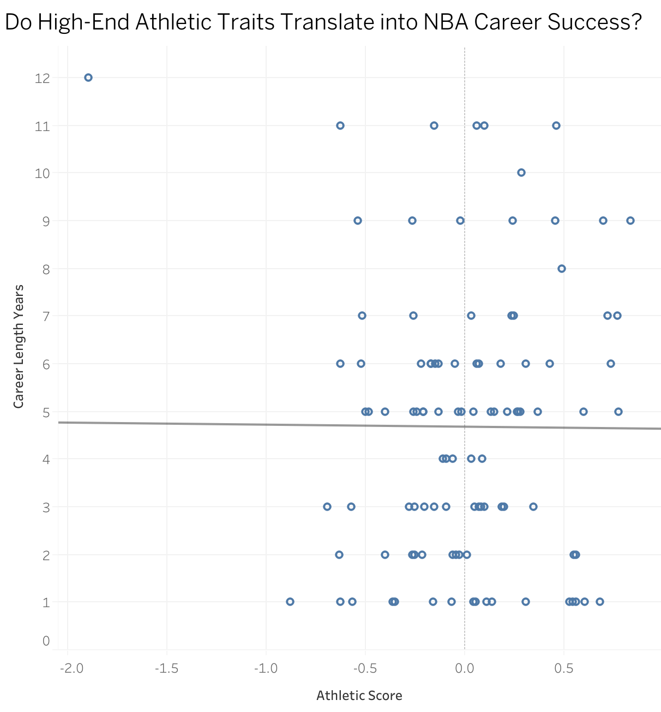
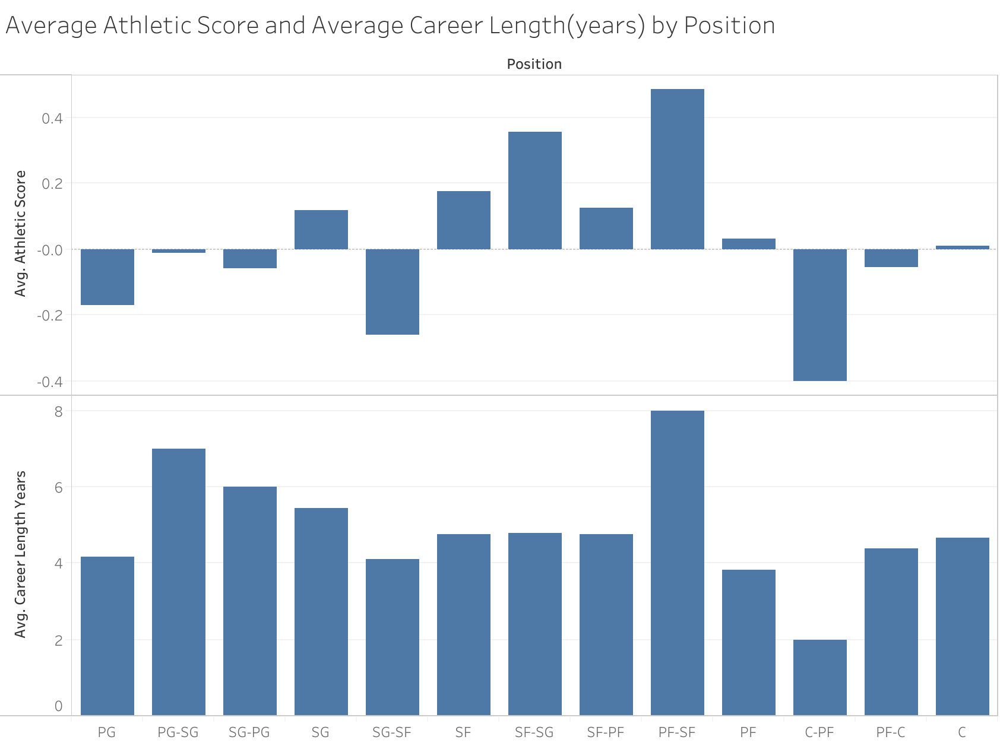

NBA Athletic Score Project Ismail Ismail
# 🏀 Do High-End Athletic Traits Translate into NBA Career Success?

## 🔍 Abstract  
This project investigates whether elite athletic traits measured at the NBA Draft Combine translate into longer, more successful NBA careers. Using Kaggle’s NBA dataset ([source](https://www.kaggle.com/datasets/wyattowalsh/basketball/data)), I cleaned and merged player combine results, draft history, and career stats into a single database.  

I created an **athletic score** by standardizing six key traits (height, wingspan ratio, vertical leap, bench press, agility time, sprint time). Career length (in years) was used as the main success metric.  

**Finding:** While athleticism provides obvious advantages, the data suggests **high-end athletic traits alone are not a reliable predictor of career longevity** in the NBA.  

---

## 🏀 Introduction  
- **Why it matters**: Scouts and front offices often overvalue athleticism in the draft. Players like **Jonathan Kuminga, Thon Maker, and Josh Jackson** highlight this dilemma — elite athletes who struggled to establish long careers.  
- **Research Question**:  
  > Do players with above-average athletic traits (measured at the Combine) have longer NBA careers compared to less athletic peers?  

---

## 📂 Data & Cleaning  
- Source: Kaggle NBA Dataset ([link](https://www.kaggle.com/datasets/wyattowalsh/basketball/data))  
- Steps Taken:  
  - Merged combine stats, draft info, and career data.  
  - Standardized height, wingspan, agility, sprint, etc.  
  - Created derived metrics (career length, wingspan ratio).  
  - Built SQL **views** to clean and restructure data.  

Example SQL Snippet:  
```sql
CREATE VIEW player_full_career AS
SELECT
    player_combine_draft.player_id,
    player_combine_draft.display_first_last,
    player_combine_draft.position,
    player_combine_draft.height_in,
    player_combine_draft.wingspan,
    player_combine_draft.vertical_leap,
    player_combine_draft.bench_reps,
    player_combine_draft.agility_time,
    player_combine_draft.sprint_time,
    player_combine_draft.draft_season,
    player_combine_draft.draft_round,
    player_combine_draft.overall_pick,
    player_combine_draft.drafted_team,
    common_player_info.from_year,
    common_player_info.to_year,
    (common_player_info.to_year - common_player_info.from_year + 1) AS career_length_years
FROM player_combine_draft
LEFT JOIN common_player_info
    ON player_combine_draft.player_id = common_player_info.person_id;
```
---
## 📈 Visuals (Tableau)  

1. **Scatter Plot: Athletic Score vs Career Length**  
   - Displays individual players’ career lengths against their athletic scores.  
   - The trendline is nearly flat, showing a very weak relationship between the two variables.  
   -   

2. **Bar Chart: Average Athletic Score & Career Length by Position**  
   - Top panel: Average athletic score for each position (primary/secondary combined).  
   - Bottom panel: Average career length (years) for each position.  
   - Takeaway: Some positions (like PF-SF) combine both higher athletic scores and longer careers, but the overall trend is inconsistent and not strong.  
   -   

---

## 📊 Results  

- **Scatter plot:** The relationship between athletic score and career length was nearly nonexistent (trendline ≈ flat, R² close to 0). Highly athletic players sometimes had short careers, while less athletic players often lasted longer.  
- **Bar chart:** By position, there were some differences — PF-SF players showed both higher athleticism and longer average careers, while centers had lower athletic scores but average career lengths. Guards generally had shorter careers regardless of athleticism.  
- **Draft round effect:** Prior research and exploratory checks suggest that draft position likely predicts career length more strongly than athletic testing.  
- **Outliers:** Players like Thon Maker and Josh Jackson illustrate the point — great athletic testing numbers, but short careers.  

Key takeaways:  
- **Forwards (PF-SF)** may benefit from versatility, showing both higher scores and longer careers.  
- **Centers (C)** rely more on size/skill than combine metrics, landing around average longevity.  
- **Guards (PG, SG)** face higher turnover and shorter careers, regardless of athleticism.  

---

## 💬 Discussion  

The combined evidence from the scatter and bar charts suggests that **athletic traits measured at the combine are not reliable predictors of NBA career longevity**. While athleticism helps players get drafted, sustaining a career depends on other variables.  

- **Injuries:** Especially harmful for athletic-dependent players, cutting careers short.  
- **Role fit & team context:** Even explosive athletes struggle if their skillset doesn’t match modern team needs.  
- **Skill development:** Longevity favors players who evolve beyond raw athleticism.  

📌 **Takeaway:** Combine results should be interpreted cautiously. Teams that weigh adaptability, skill, and health alongside athleticism are more likely to identify long-term contributors.  

---

## 🔮 Future Work  

This project measured **career length in years** as the main outcome. Extensions could:  
- Incorporate **career quality** metrics (All-Star appearances, WS/48, BPM, etc.).  
- Adjust for **injury history** and missed games.  
- Compare across **eras** to test if athleticism matters differently in the 2000s vs modern NBA.  
- Apply **survival analysis** to better capture career “risk factors” over time.  


---
